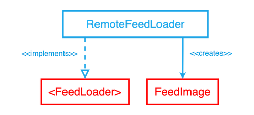

# The Feed API challenge - iOSLeadEssentials.com


It's time to put your skills to the test!

You are called to implement the `RemoteFeedLoader` to load a collection of images from a backend.

Your implementation must:

1) Conform to the `<FeedLoader>` protocol creating an array of `FeedImage`:



2) Follow the backend contract below:

### Remote Feed Image Spec

| Property      | Type                |
|---------------|---------------------|
| `image_id`    | `UUID`              |
| `image_desc`  | `String` (optional) |
| `image_loc`   | `String` (optional) |
| `image_url`	| `URL`               |

### Payload contract

```
200 RESPONSE

{
	"items": [
		{
			"image_id": "a UUID",
			"image_desc": "a description",
			"image_loc": "a location",
			"image_url": "https://a-image.url",
		},
		{
			"image_id": "another UUID",
			"image_desc": "another description",
			"image_url": "https://another-image.url"
		},
		{
			"image_id": "even another UUID",
			"image_loc": "even another location",
			"image_url": "https://even-another-image.url"
		},
		{
			"image_id": "yet another UUID",
			"image_url": "https://yet-another-image.url"
		}
		...
	]
}
```


## Instructions

The goal of this exercise is to get you used to the TDD flow.

We've provided you with appropriate tests to guide and validate your solution. You need to make all the tests pass, one by one, by implementing the `load` method in the existing `RemoteFeedLoader` class.

1) Fork the latest version of the challenge repo.

2) Open the `FeedAPIChallenge.xcodeproj` project.

3) There are two main folders in the project:
	- The `FeedAPIChallenge` folder contains the production types, including the `RemoteFeedLoader` and dependencies for requesting and loading the feed remotely. ***You only need to change the `RemoteFeedLoader.swift` file to implement the `load` method.***
	
	- The `Tests` folder contains the test cases. ***You only need to change the `LoadFeedFromRemoteUseCaseTests.swift` file to implement all test cases.***

4) Use the `Tests/LoadFeedFromRemoteUseCaseTests.swift` to validate your implementation. Uncomment and implement one test at a time following the TDD process: Make the test pass, commit, and move to the next one. 

5) While developing your solutions, run all tests with CMD+U. 

6) When all tests are passing and you're done implementing your solution, create a Pull Request from your branch to the main challenge repo.


## Guidelines

1) Aim to commit your changes every time you add/alter the behavior of your system or refactor your code.

2) Aim for descriptive commit messages that clarify the intent of your contribution which will help other developers understand your train of thought and purpose of changes.

3) The system should always be in a green state, meaning that in each commit all tests should be passing.

4) The project should build without warnings.

5) The code should be carefully organized and easy to read (e.g. indentation must be consistent).

6) Make careful and proper use of access control, marking as `private` any implementation details that aren’t referenced from other external components.

7) Aim to write self-documenting code by providing context and detail when naming your components, avoiding explanations in comments.

8) Strive to produce a clean solution as it can be **an ideal addition to your project portfolio**!
