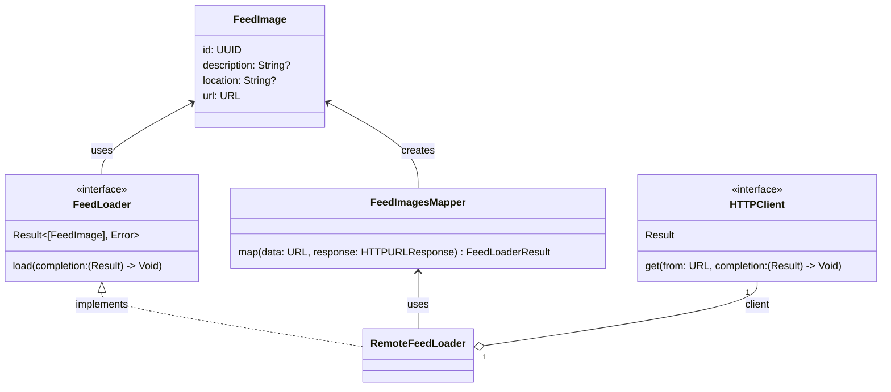

```mermaid
classDiagram

class FeedImage {
  id: UUID
	description: String?
	location: String?
	url: URL
}

class FeedLoader {
  <<interface>>
  Result<[FeedImage], Error>
  load(completion: (Result) -> Void)
}

class HTTPClient {
  <<interface>>
  Result<Data, HTTPURLResponse, Error>
  get(from: URL, completion: (Result) -> Void)
}

class FeedImagesMapper {
  map(data: URL, response: HTTPURLResponse) FeedLoaderResult
}

FeedImage <-- FeedLoader : uses
FeedLoader <|.. RemoteFeedLoader : implements
FeedImagesMapper <-- RemoteFeedLoader : uses
FeedImage <-- FeedImagesMapper : creates
HTTPClient "1" --o "1" RemoteFeedLoader : client

```

